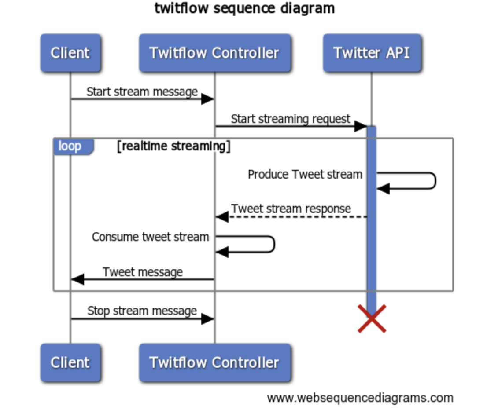

# twitflow

This repository is a demonstration of making a web application to stream realtime Tweets from Twitter using the [Twitter API](https://developer.twitter.com/en/docs/twitter-api)

## Case Introdution

Please see the [PDF document](doc/coopx-case.pdf) in the `doc` folder.

## Attempted Solutions

### Solution 1 - Java Backend/Angular Frontend

In this solution, the idea was to create a Java microservice that would consume the Twitter API and expose an API to the client. The Twitter API specification was converted into client code using [OpenAPI Generator](https://openapi-generator.tech/). The same generator was used for the service API.

The issue here is that the generated models did not support streaming, either from the Twitter API or from the Java service.

Development work on the Angular frontend here was wasted time.

### Solution 2 - Angular Frontend

In this solution, I attempted to simply create an Angular frontend and call the Twitter API from there. However, this resulted in the [CORS](https://developer.mozilla.org/en-US/docs/Web/HTTP/CORS) issue and I did not want to spend more time here as this seemed hacky.

### Solution 3 - Java Backend (with WebSockets)/Simple HTML Frontend

I remembered using RabbitMQ at a previous position to handle asynchronous message sending as a result of changes in an API. This allowed for "API callbacks", in a way. The challenge with this assignment was that this was not simply an API call - but that data needed to be streamed back to the client.

After some research, it looked like I could use WebSockets to open connection to deliver data. Luckily, the [Spring Framework](https://spring.io/projects/spring-framework) has a robust WebSocket and messaging framework to provide this implementation.

## Implementing the solution

The Twitter API was consumed in Java by streaming in the result of the API call to a stream, and reading the data until the service receives a `stop` message, and the HTTP connection is closed. This allows for the stream to be re-opened at a later point.

The frontend is able to start and stop the stream by publishing a message to the tweet topic. While this seems a little hacky, I think it is okay to use messaging in this sense (without a payload - the presence of a message _is_ the message).

The frontend is a very simple HTML page with some JavaScript behind it to perform the messaging functions. Tweets are inserted into the DOM and removed as requested. The styling is from [Bootstrap](https://getbootstrap.com/).

### Sequence Diagram

## Deploying the solution

The [CI/CD pipeline](.github/workflows/cicd.yml) is implemented in GitHub Actions, and is a two-stage process. The first stage builds and tests the project, while the second stage deploys it to AWS, using CodeDeploy. This application is hosted in a single EC2 instance.

## Running the application

* Set the environment variable `TWITTER_API_BEARER_TOKEN` to your own value
* `docker-compose build --no-cache`
* `docker-compose up`
* [http://localhost:8080](http://localhost:8080)

## How could this be better?

* Backend and frontend should be decoupled into two separate projects
* Infrastructure should be coded such that the entire application can be deployed without any manual intervention
* Point my own domain to the application instance
* Frontend authentication/using your own API key
* Support multiple simultaneous users (multiple can stream, but if one stops they all stop - should be a somewhat easy fix)

### Backend improvements

The backend itself isn't too bad, but it could have been great to expose an API specification such that it could be consumed by clients, instead of relying on messaging.

### Frontend improvements

The frontend could have a more pleasant user experience and appearance, but I am a bit rusty on Angular and coming up to speed here was not the best use of time.

### Infrastructure improvements

This was the first time I deployed an application to AWS, but I am satisified with the process and what I have learned. It is really exciting to make changes and see them pushed to production, and makes the entire process easier.

In a production application, there would be load balancing, redundancy, authentication, monitoring, logging and alerting.

## Presentation

The PowerPoint presentation [twitflow-presentation.pptx](doc/twitflow-presentation.pptx) will be presented.
